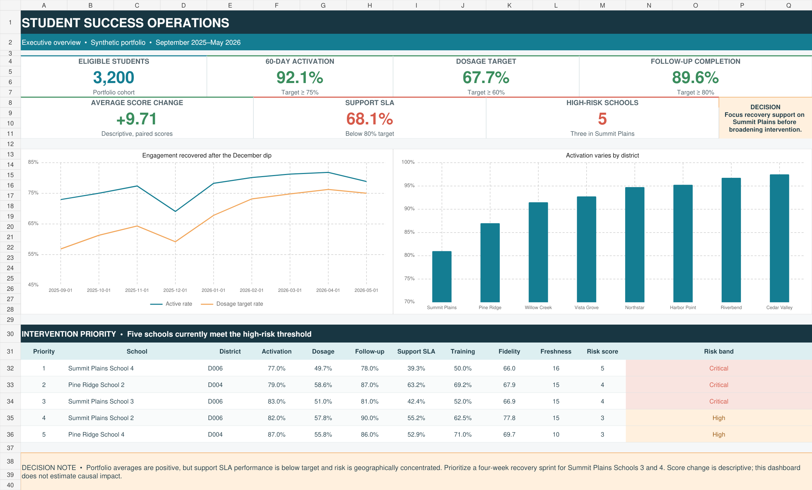
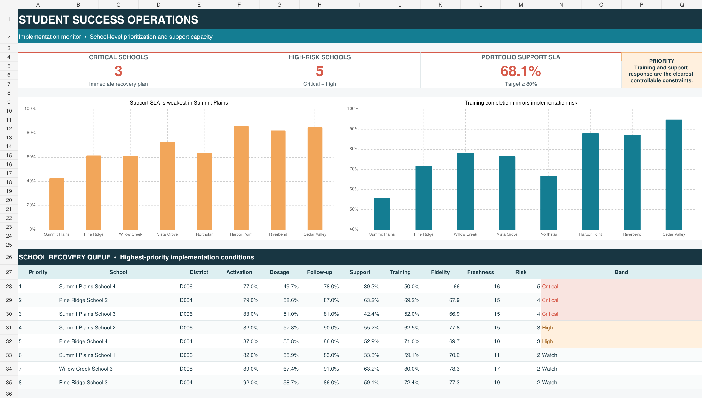
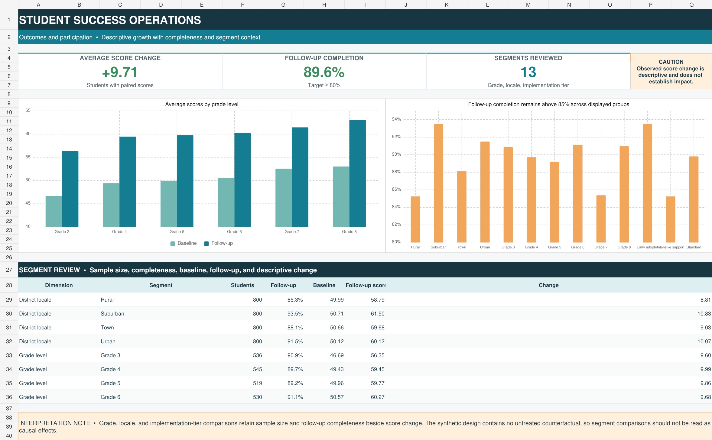

# Student Success Operations Dashboard

[](https://github.com/mjeans/student-success-operations-dashboard/actions/workflows/validate-dashboard.yml)

An end-to-end education operations analytics case study that turns synthetic
student engagement, assessment, support, and implementation data into a
decision-ready dashboard. The project demonstrates practical SQL, dimensional
modeling, Power BI measure design, data-quality controls, dashboard
communication, and operational recommendations.

> All records are deterministic and synthetic. No client, school, or student
> data are included.



## The decision question

A student-success program is operating across eight districts and 32 schools.
Leaders need to know whether students are activating and receiving adequate
dosage, whether outcomes are being collected, and where limited implementation
support should be directed first.

## Portfolio findings

| Measure | Result | Operational interpretation |
|---|---:|---|
| Eligible students | 3,200 | Eight equally sized synthetic districts |
| 60-day activation | 92.1% | Above the 75% operating target overall |
| Dosage target attainment | 67.7% | Above target, with meaningful district variation |
| Follow-up completion | 89.6% | Above target, but not complete enough to ignore missingness |
| Average score change | +9.71 | Descriptive growth among students with paired scores |
| Support SLA attainment | 68.1% | Below the 80% target and the largest portfolio-wide constraint |
| High-risk schools | 5 | Three are concentrated in Summit Plains |

The headline average is positive, but it conceals a concentrated operational
problem. Summit Plains Schools 3 and 4 miss four or more transparent risk
thresholds. The recommended response is a targeted recovery sprint focused on
training, workflow fidelity, support escalation, and data freshness—not a
portfolio-wide redesign.

### Implementation monitor



### Outcomes and participation



## What this project demonstrates

- A star-schema-inspired model with dimension and fact tables at explicit grain
- SQL views, CTEs, conditional aggregation, window functions, and rankings
- Reconciled KPI definitions and school-level operational risk rules
- Segment monitoring that preserves sample sizes and missing-outcome context
- Power BI-ready DAX measures, theme, page specification, and source files
- A polished Excel analyst companion for reviewers without Power BI Desktop
- Deterministic synthetic-data generation and zero-dependency SQLite validation
- Automated regression tests and GitHub Actions continuous integration
- A short decision memo that separates evidence, action, and causal limits

## Repository map

```text
build/generated/       Locally generated, ignored Power BI-ready source tables
sql/                   Schema, metric views, KPIs, trends, risk, and QA queries
outputs/               Saved query results used for reconciliation
powerbi/               DAX measures, theme, and Desktop build guide
assets/                Dashboard preview images
docs/                  Data model, metric dictionary, and decision memo
scripts/               Deterministic data, SQLite, and query builders
tests/                 Regression and reconciliation tests
```

## Reproduce the analysis

Only Python's standard library is required for the data and SQL pipeline.

```bash
python scripts/generate_data.py
python scripts/build_database.py
python scripts/run_queries.py
python -m unittest discover -s tests -v
```

Or run the complete workflow with `make all`.

The generated row-level fixtures and SQLite database are intentionally ignored.
The generator, schema, aggregate outputs, dashboard workbook, and screenshots
remain public, while CI confirms the outputs can be reproduced without
differences.

## Power BI implementation

The `powerbi/` folder includes the measures and theme, and
`powerbi/build-guide.md` specifies the three report pages. Microsoft requires
Power BI Desktop to create or convert PBIX/PBIP files, so this repository does
not present a fabricated binary as a verified dashboard. The committed source
tables, DAX, metric definitions, analyst workbook, and screenshots provide a
fully auditable implementation package.

## Interpretation boundary

The score analysis is descriptive. Without an untreated comparison group, the
observed change cannot be attributed causally to the program. The risk score is
also a transparent prioritization rule, not a validated predictive model.

## Documentation

- [Data model](docs/data-model.md)
- [Metric definitions](docs/metric-definitions.md)
- [Decision memo](docs/decision-memo.md)
- [Power BI build guide](powerbi/build-guide.md)
- [Analyst companion workbook](student-success-operations-dashboard.xlsx)

Built as a public portfolio demonstration by [Matthew Jeans, PhD](https://github.com/mjeans).
