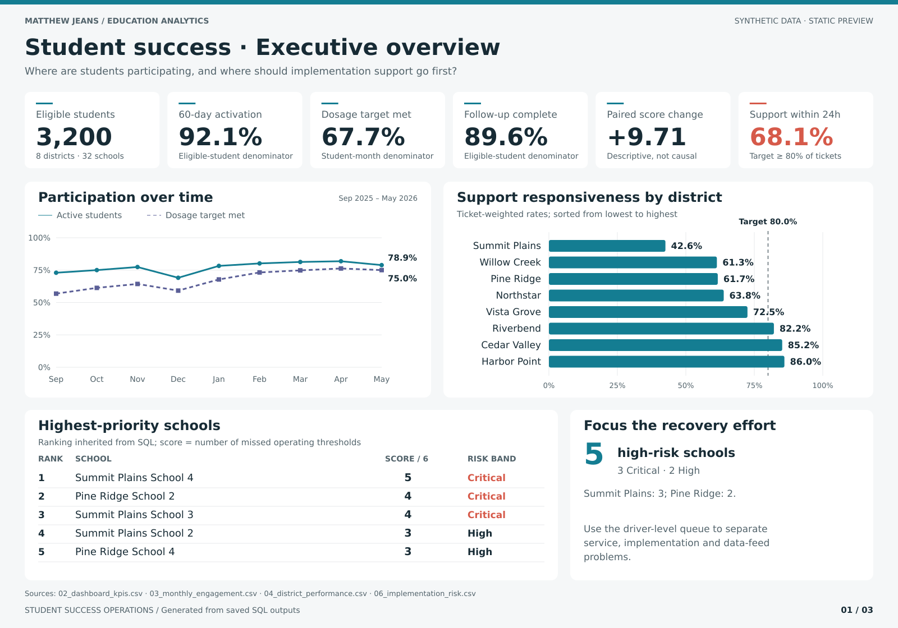
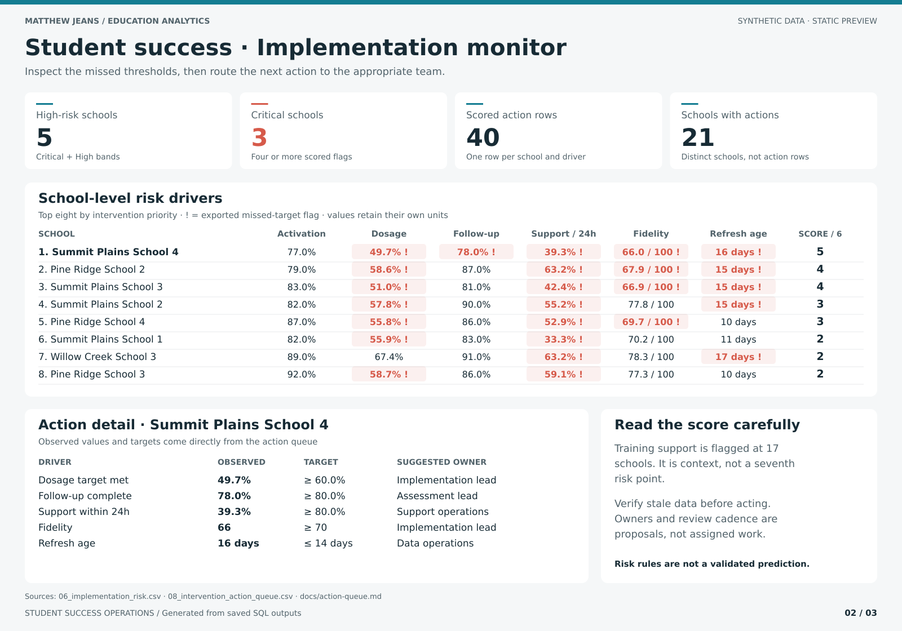
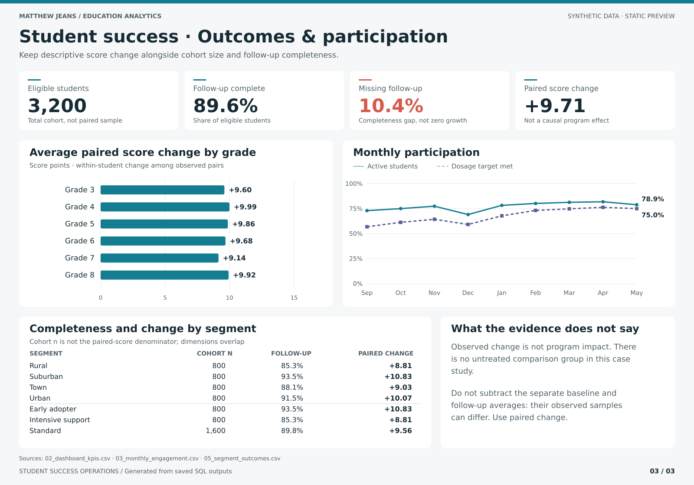

# Student Success Operations Dashboard

[](https://github.com/mjeans/student-success-operations-dashboard/actions/workflows/validate-dashboard.yml)

An end-to-end education operations analytics case study that turns synthetic
student engagement, assessment, support, and implementation data into a
decision-ready dashboard. The project demonstrates practical SQL, dimensional
modeling, Power BI measure design, data-quality controls, reproducible visual
reporting, and operational recommendations.

> All records are deterministic and synthetic. No client, school, or student
> data are included. The graphics below are generated, noninteractive SVG
> previews, not Power BI Desktop screenshots.



## The decision question

A student-success program is operating across eight districts and 32 schools.
Leaders need to know whether students are activating and receiving adequate
dosage, whether outcomes are being collected, and where limited implementation
support should be directed first.

## Portfolio findings

| Measure | Result | Operational interpretation |
|---|---:|---|
| Eligible students | 3,200 | Eight equally sized synthetic districts |
| 60-day activation | 92.1% | Above the 75% operating target overall |
| Dosage target attainment | 67.7% | Student-month measure; above target with district variation |
| Follow-up completion | 89.6% | Missing outcomes still require attention |
| Average score change | +9.71 | Descriptive change among students with paired scores |
| Support SLA attainment | 68.1% | Below the 80% ticket-response target |
| High-risk schools | 5 | Three in Summit Plains and two in Pine Ridge |

Portfolio averages conceal concentrated operational problems. Summit Plains
School 4, Pine Ridge School 2, and Summit Plains School 3 miss four or more
transparent risk thresholds. The proposed response is targeted follow-up on
implementation, assessment completeness, support responsiveness, and data
freshness rather than a portfolio-wide redesign. Low training is useful
context, not proof of the cause of a shortfall.

### Implementation monitor



### Outcomes and participation



The graphics are generated directly from the saved SQL outputs. They use the
existing project theme, direct labels, explicit units, and symbols as well as
color for missed thresholds. See [Visual design and reproduction](docs/visual-design.md).

## From risk ranking to action

The [school risk table](outputs/06_implementation_risk.csv) exposes six scored
driver flags and a separate training-support flag. The
[intervention action queue](outputs/08_intervention_action_queue.csv) turns each
missed threshold into an inspectable row with the observed value, target,
proposed action, suggested owner and review cadence. The reference data contain
40 actions across 21 schools; the original 32-school scores and ranking are
unchanged and protected by a frozen-baseline regression test.

Summit Plains School 4 generates five actions: dosage, follow-up, support
response, fidelity and freshness. Its low training rate is context, not a
seventh score component. See [Action queue rules](docs/action-queue.md) for
thresholds, routing, limitations and safe aggregation.

The implementation SVG now displays the queue alongside the school-level
flags. The existing Excel workbook and original PNG files remain the original
snapshot; they have not been refreshed to include this extension. The SVGs
are the current README previews. No native Power BI report is claimed as tested.

## What this project demonstrates

- SQL views, CTEs, conditional aggregation, window functions, and rankings
- A dimensional model with explicit row-level units and reconciled KPI definitions
- Explainable risk-driver drill-down and an action-oriented routing queue
- Segment monitoring that preserves cohort size and missing-outcome context
- Power BI-ready DAX measures, theme, page specifications, and source files
- An Excel analyst companion representing the original dashboard snapshot
- Deterministic synthetic-data generation and standard-library SQLite validation
- Source-driven SVG previews with automated checks against stale graphics
- Regression tests and GitHub Actions continuous integration
- A decision memo that separates evidence, proposed action, and causal limits

## Repository map

```text
build/generated/       Locally generated, ignored Power BI-ready source tables
sql/                   Schema, metric views, KPIs, trends, risk, action queue and QA
outputs/               Saved query results used for reconciliation
powerbi/               DAX measures, theme, and Desktop build guide
assets/                Generated SVG previews and original PNG snapshots
docs/                  Data model, metric dictionary, action rules and visual design
scripts/               Deterministic data, SQLite, query and SVG builders
tests/                 Regression, frozen-baseline, reconciliation and preview tests
```

## Reproduce the analysis and graphics

Python's standard library is sufficient for the data, SQL, and SVG pipeline.

```bash
python scripts/generate_data.py
python scripts/build_database.py
python scripts/run_queries.py
python scripts/render_previews.py
python -m unittest discover -s tests -v
```

Or run `make all`, which executes those stages in order. Rebuild the database
after updating the repository so the current risk-driver views are installed.

To verify that the displayed graphics still match the saved outputs without
writing files:

```bash
python scripts/render_previews.py --check
```

CI regenerates the data and query results, verifies the committed SVGs, checks
for changed or untracked query outputs, and runs the regression suite. The
row-level fixtures and SQLite database remain ignored. Do not change source
results simply to make a graphic or a regression test pass.

## Power BI implementation

The `powerbi/` folder includes measures, a theme, and a build guide for three
report pages plus an action-queue drillthrough page. These are implementation
specifications, not evidence of a completed or tested PBIX/PBIP report.
The generated SVGs provide inspectable static visual reports independently of
Power BI Desktop. The original workbook is unchanged.

## Interpretation boundary

Without an untreated comparison group, observed score change cannot be
attributed causally to the program. Paired score change is not the difference
between separate baseline and follow-up averages when their observed samples
differ. Cohort size is not necessarily the paired-score sample size. Locale
and implementation-tier rows overlap and must not be added together.

The risk score is a transparent prioritization rule, not a validated predictive
model. Suggested actions, owners and cadences require local review.

## Documentation

- [Data model](docs/data-model.md)
- [Metric definitions](docs/metric-definitions.md)
- [Action queue rules](docs/action-queue.md)
- [Decision memo](docs/decision-memo.md)
- [Visual design and reproduction](docs/visual-design.md)
- [Power BI build guide](powerbi/build-guide.md)
- [Original analyst companion workbook](student-success-operations-dashboard.xlsx)

Built as a public portfolio demonstration by [Matthew Jeans, PhD](https://github.com/mjeans).
