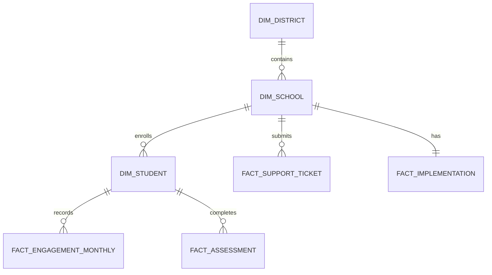

# Data model

The case study uses a small star-schema-inspired model. Dimensions contain
descriptive attributes; facts preserve their natural operational grain.

| Table | Grain | Key |
|---|---|---|
| `dim_district` | One district | `district_id` |
| `dim_school` | One school | `school_id` |
| `dim_student` | One student | `student_id` |
| `fact_engagement_monthly` | One student per month | `student_id`, `month_start` |
| `fact_assessment` | One assessment event | `assessment_id` |
| `fact_support_ticket` | One support ticket | `ticket_id` |
| `fact_implementation` | One school implementation snapshot | `school_id` |

## Modeling choices

- Engagement is stored monthly to match the operational review cadence.
- Assessments remain event-level so baseline and follow-up completeness can be
  audited independently.
- Support tickets join at the school level because they represent
  implementation support rather than individual student service.
- Metric views calculate student and school summaries without denormalizing the
  committed source files.
- SQLite provides a zero-dependency validation harness. The same SQL concepts
  transfer to AWS Athena, Snowflake, PostgreSQL, or a warehouse-backed BI model.
